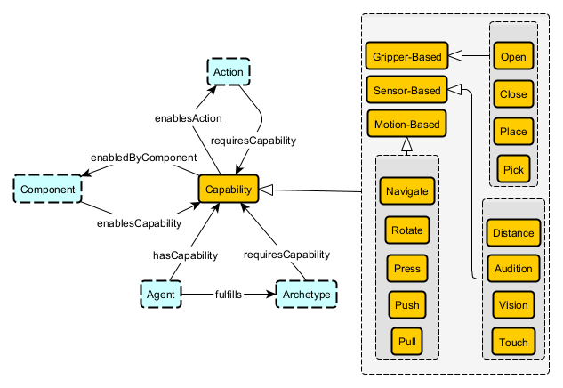
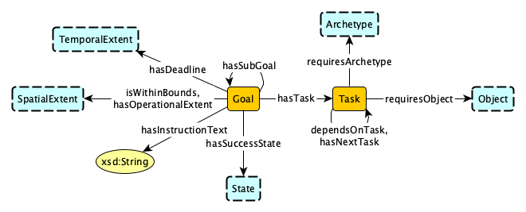
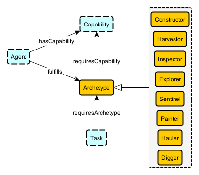
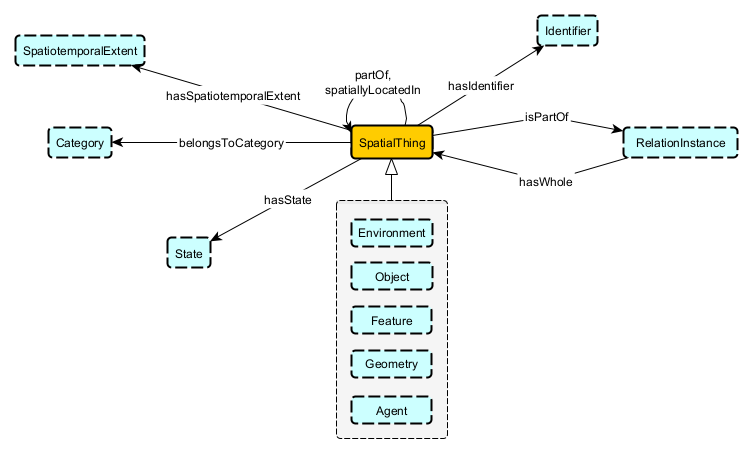
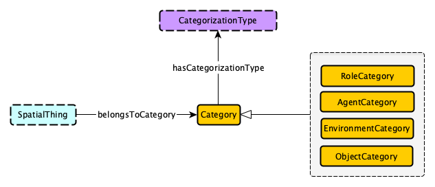
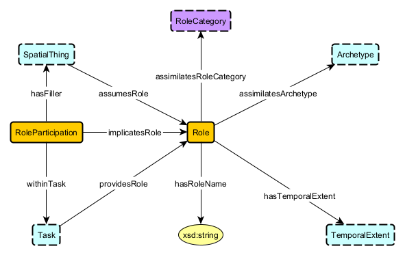
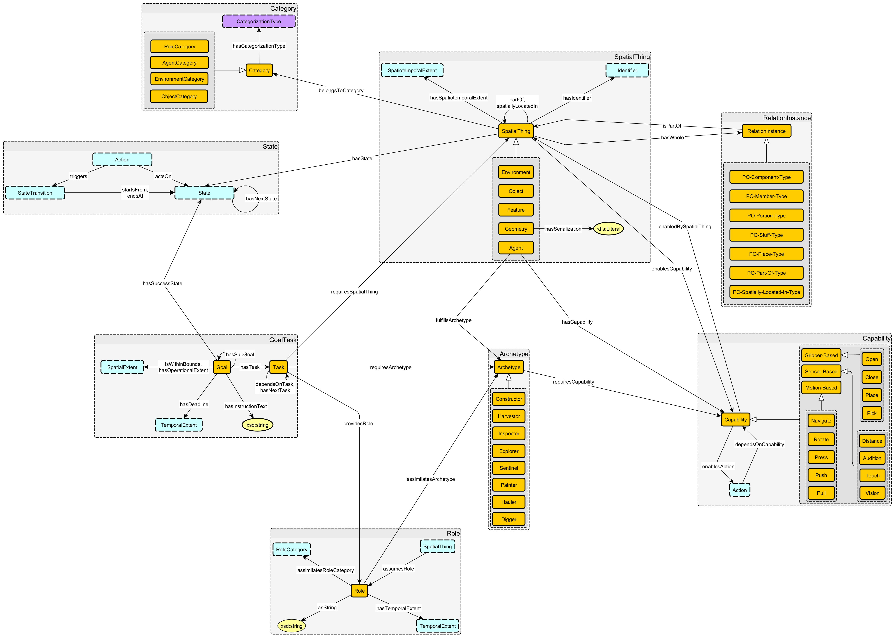

# Modular Ontology for Autonomous Robotic Orchestration

**Authors:** Michael McCain, Chris Davis Jaldi, Shreyas Casturi, and Susan Shrestha

## Use Case Scenario

### Narrative

Domains that rely heavily on robotics have shown an increasing interest in autonomous systems that are collaborative, intelligent, and capable of reasoning [1, 2, 3]. In pursuit of these interests, a standard method for increasing autonomy among robots [2] and enabling collaboration is the use of knowledge representation in the form of ontologies [4] and knowledge graphs (KG) [2, 3, 5]. Due to the relatively recent focus on achieving these ambitious and complex autonomous systems, there are many competing approaches, especially in the context of task planning [1, 2, 5, 6, 7, 8]. However, these approaches vary in terms of ontology design or methodology, but do use the World Wide Web Consortium's (W3C) Web Ontology Language (OWL) [9] as the primary logic-based language for semantic representation. Unfortunately, as highlighted in [2], many of these ontologies lack reusability and do not meet the need for the confluence of existing ontologies.

Considering these aspects for the current ontological representations of complex autonomous systems, we want to engineer an ontology that could enable these multi-agent systems (MAS) [3] to be governed and commanded by an AI Orchestrator capable of the following: understanding its environment, decomposing goals into atomic subtasks, agent assignment based on capabilities, and status verification. More importantly, it would be designed to be general enough to support reusability and allow for adaptation to the domain of need. This ontology would be designed using state-of-the-art (SOTA) best practices to ensure modularity and reusability [10, 11] through the use of ontological design patterns (ODPs) [12]. This would fill two needs. The first would be to provide an ontology that allows for more complex autonomous MAS. The second is the demand for a reusable ontology that facilitates the merging of existing ontologies across domains that utilize these MAS.

### Competency Questions

- What set of agents are required to complete primary goal y?
- What are the classifications/categories that of a set of objects?
- What objects are required for goal g?
- What objects are required to complete task x?
- What are the dependent tasks for task z?
- Which tasks share common dependent tasks across different goals?

### Integrated Datasets

[RH20T-P](https://sites.google.com/view/rh20t-primitive/main)

[Droid](https://droid-dataset.github.io/)

[BridgeData V2](https://rail-berkeley.github.io/bridgedata/)

[MOAD](https://www.robot-manipulation.org/nist-moad)

[ALFRED](https://askforalfred.com/)

### References

[1] A. Olivares-Alarcos, S. Foix, S. Borgo, N. G. Alenyà, Ocra – an ontology for collaborative robotics and adaptation, Computers in Industry 138 (2022) 103627–103627. doi:10.1016/j.compind.2022.103627.

[2] E. Aguado, V. Gomez, M. Hernando, C. Rossi, R. Sanz, A survey of ontology-enabled processes for dependable robot autonomy, Frontiers in Robotics and AI 11 (2024). doi:10.3389/frobt.2024.1377897.

[3] H. Du, S. Thudumu, R. Vasa, K. Mouzakis, A survey on context-aware multi-agent systems: Techniques, challenges and future directions, 2024. URL: https://arxiv.org/abs/2402.01968v2.

[4] A. Ricci, M. Piunti, M. Viroli, Environment programming in multi-agent systems: an artifact-based perspective, Autonomous Agents and Multi-Agent Systems 23 (2010) 158–192. doi:10.1007/s10458-010-9140-7.

[5] H. Li, P. Goncalves, V. Ragavan, A. Olivares-Alarcos, E. M. Barreto, D. Beβler, J. Bermejo, S. Borgo, A. Chibani, J. Carbonera, M. Diab, S. Fiorini, A. Gyrard, M. Habib, A. Khamis, K. Moulouel, H. Nakawala, B. Nguyen, C. Nowak, J. Olszewska, E. Pignaton, E. Prestes, J. Quintas, S. Redfield, R. Sanz, C. Schlenoff, E. Tosello, Ieee standard for autonomous robotics (aur) ontology (2021). URL: https://ieeexplore.ieee.org/document/9774339?utm_source=chatgpt.com. doi:10.1109/ieeestd. 2022.9774339.

[6] X. Sun, Y. Zhang, J. M. Chen, Rtpo: A domain knowledge base for robot task planning 8 (2019) 1105–1105. doi:10.3390/electronics8101105.

[7] C. Z. Sprenger, J. Antonio, N. U. Baier, Orpp—an ontology for skill-based robotic process planning in agile manufacturing, Electronics 13 (2024) 3666–3666. URL: https://www.mdpi.com/2079-9292/13/18/3666. doi:10.3390/electronics13183666.

[8] L. Kinder, T. Käfer, Static and adaptive planning with wot td by generating python objects as intermediary representations using large language models, Lecture notes in computer science (2025) 256–273. doi:10.1007/978-3-031-78955-7_21.

[9] W. W. W. C. (W3C), Owl 2 web ontology language primer (second edition), URL: https://www.w3.org/TR/2012/REC-owl2-primer-20121211/.

[10] C. Shimizu, Q. Hirt, P. Hitzler, Modl: A modular ontology design library, 2019. URL: https://arxiv.org/abs/1904.05405.

[11] C. Shimizu, K. Hammar, P. Hitzler, Modular ontology modeling, Semantic Web (2022) 1–31. doi:https://doi.org/10.3233/sw-222886.

[12] A. Hogan, E. Blomqvist, M. Cochez, C. D’amato, G. D. Melo, C. Gutierrez, S. Kirrane, J. E. L. Gayo, R. Navigli, S. Neumaier, A.-C. N. Ngomo, A. Polleres, S. M. Rashid, A. Rula, L. Schmelzeisen, J. Sequeda, S. Staab, A. Zimmermann, Knowledge graphs, ACM Computing Surveys 54 (2022) 1–37. doi:10.1145/3447772.

## Modules

<!-- There should be one module section per module (essentially per key-notion) -->

### Capability

**Source Pattern:** None  
**Source Data:** RH20T-P, DROID

#### Description

Specifications to differentiate and define what actions an agent can perform.

#### Axioms

- `enablesAction some Action SubClassOf Capability`  
  The scoped domain of enablesAction, scoped by Action, is of Capability.
- `Action SubClassOf inverse enablesAction some Capability
`  
  Every action belongs to some (min1) Capability.
- `enabledBySpatialThing some SpatialThing SubClassOf Capability`  
  The scoped domain of enabledBySpatialThing, scoped by SpatialThing, is of Capability.
- `Capability SubClassOf enabledBySpatialThing SpatialThing`  
  Every Capability belongs to some (min1) SpatialThing.
- `Capability SubClassOf enabledBySpatialThing max 1 SpatialThing`  
  Every Capability is enabled by at most 1 SpatialThing.
- `Gripper-Based SubClassOf Capability`  
  Every Gripper-Based Capability is an Capability.
- `Open/Close SubClassOf Gripper-Based`  
  Every Open/Close Gripper-Based Capability is a Gripper-Based Capability.
- `Place/Pick SubClassOf Gripper-Based
`  
  Every Place/Pick Gripper-Based Capability is a Gripper-Based Capability.
- `Place/Pick DisjointWith Open/Close`  
  Place and Pick Gripper-Based Capabilities are exclusive from Open and Close GBC.
- `Sensor-Based SubClassOf Capability`  
  Every Sensor-Based Capability is an Capability.
- `Distance SubClassOf Sensor-Based`  
  Every Distance Sensor-Based Capability is a Sensor-Based Capability.
- `Audition SubClassOf Sensor-Based`  
  Every Audition Sensor-Based Capability is a Sensor-Based Capability.
- `Touch SubClassOf Sensor-Based
`  
  Every Touch Sensor-Based Capability is a Sensor-Based Capability.
- `Vision SubClassOf Sensor-Based`  
  Every Vision Sensor-Based Capability is a Sensor-Based Capability.
- `“Sensor-Based Subclass” DisjointWith “Sensor-Based Subclass”`  
  All Sensor-Based Subclasses are exclusive from each other.
- `Motion-Based SubClassOf Capability`  
  Every Motion-Based Capability is an Capability.
- `Move SubClassOf Motion-Based`  
  Every Move Motion-Based Capability is a Motion-Based Capability.
- `Rotate SubClassOf Motion-Based`  
  Every Rotate Motion-Based Capability is a Motion-Based Capability.
- `Press SubClassOf Motion-Based`  
  Every Press Motion-Based Capability is a Motion-Based Capability.
- `Push/Pull SubClassOf Motion-Based`  
  Every Push/Pull Motion-Based Capability is a Motion-Based Capability.
- `“Motion-Based Subclass” DisjointWith “Motion-Based Subclass”
`  
  All Motion-Based Subclasses are exclusive from each other.

#### Remarks

- Additional subclasses to be added in the future.

### Goal-Task

**Source Pattern:** Trajectory, SpatiotemporalExtent, Description-Situation  
**Source Data:** DROID, RH20T-P

#### Description

Specifications to represent desired outcomes and anchors to atomic unit of work with hierarchies, decomposition and sequence semantics

#### Axioms

- `Goal SubClassOf hasDeadline some TemporalExtent`  
  If a Goal exists, it must have at least one hasDeadline, and is of type TemporalExtent
- `Goal SubClassOf hasDeadline max 1 TemporalExtent`  
  For every Goal, there exists no or exactly 1 hasDeadline, and is of type TemporalExtent
- `Thing SubClassOf isWithinBounds only SpatialExtent`  
  For any thing, if there exists isWithinBounds, the global range is SpatialExtent.
- `Goal SubClassOf isWithinBounds only SpatialExtent`  
  For every Goal there may exist isWithinBounds, and is of type SpatialExtent.
- `Thing SubClassOf hasOperationalExtent only SpatialExtent`  
  For any thing, if there exists hasOperationalExtent, the global range is SpatialExtent.
- `Goal SubClassOf hasInstructionalText max 1 xsd:String`  
  For every Goal, there exists no or exactly 1 hasInstructionalText, and is of type xsd:String
- `hasSubGoal some Goal SubClassOf Goal`  
  The scoped domain of hasSubGoal, scoped by Goal, is of Goal.
- `Goal SubClassOf hasSubGoal only Goal`  
  The scoped range of hasSubGoal, scoped by Goal, is of Goal
- `Thing SubClassOf hasSuccessState only State`  
  For any thing, if there exists hasSuccessState, the global range is State.
- `hasTask some Task SubClassOf Goal`  
  The scoped domain of hasSubGoal, scoped by Task, is of Goal.
- `Goal SubClassOf hasTask only Task`  
  The scoped range of hasSubGoal, scoped by Goal, is of Task
- `Goal SubClassOf hasTask max 1 Task`  
  For every Goal, there exists no or exactly 1 hasTask, and is of type Task
- `dependsOnTask some Task SubClassOf Task`  
  The scoped domain of dependsOnTask, scoped by Task, is of Task.
- `Task SubClassOf dependsOnTask only Task`  
  The scoped range of dependsOnTask, scoped by Task, is of Task
- `Task SubClassOf dependsOnTask only Task`  
  For every Task there may exist dependsOnTask, and is of type Task.
- `hasNextTask some Task SubClassOf Task
`  
  The scoped domain of hasNextTask, scoped by Task, is of Task.
- `Task SubClassOf hasNextTask only Task`  
  The scoped range of hasNextTask, scoped by Task, is of Task
- `Task SubClassOf hasNextTask only Task`  
  For every Task there may exist hasNextTask, and is of type Task.
- `Task SubClassOf providesRole only Role`  
  The scoped range of providesRole, scoped by Task, is of Role
- `Role SubClassOf inverse providesRole some Task`  
  For every Task, there has to be an inverse providesRole-filler and is of type Role
- `Task SubClassOf requiresSpatialThing some SpatialThing`  
  If a Task exists, it must have at least one requiresSpatialThing, and is of type SpatialThing
- `Task SubClassOf requiresArchetype only Archetype
`  
  The scoped range of requiresArchetype, scoped by Task, is of Archetype
- `Task SubClassOf requiresArchetype some Archetype`  
  If a Task exists, it must have at least one requiresArchetype, and is of type Archetype
- `Task SubClassOf requiresArchetype max 1 Archetype`  
  For every Task, there exists no or exactly 1 requiresArchetype, and is of type Archetype

### Archetype

**Source Pattern:** None  
**Source Data:** RH20T-P

#### Description

Representing the thematic capabilities of a robotic agent (E.g., Explorer, Hauler, Designer, Painter, etc.).

#### Axioms

- `Constructor SubClassOf Archetype`  
  Every Constructor is an Archetype.
- `Harvester SubClassOf Archetype`  
  Every Harvester is an Archetype.
- `Inspector SubClassOf Archetype
`  
  Every Inspector is an Archetype.
- `Explorer SubClassOf Archetype`  
  Every Explorer is an Archetype.
- `Sentinel SubClassOf Archetype`  
  Every Sentinel is an Archetype.
- `Painter SubClassOf Archetype`  
  Every Painter is an Archetype.
- `Hauler SubClassOf Archetype
`  
  Every Hauler is an Archetype.
- `Digger SubClassOf Archetype`  
  Every Digger is an Archetype.
- `Archetype SubClassOf requiresCapability only Capability`  
  The scoped range of requiresCapability, scoped by Archetype, is Capability.
- `Archetype SubClassOf requiresCapability some (min 1) Capability
`  
  Every Archetype has at a minimum 1 Capability.
- `“Archetype SubClass” DisjointWith “Archetype SubClass.”`  
  All Archetype SubClasses are all mutually exclusive Archetypes.

#### Remarks

- Additional subclasses to be added in the future. Also, disjoint axioms will likely be removed.

### SpatialThing

**Source Pattern:** Winston's Part Whole, Spatial-Object, Identifier  
**Source Data:** All

#### Description

Specification to represent physical things that exists in time and space.

#### Axioms

- `Thing SubClassOf hasIdentifier only Identifier`  
  For any thing, if there exists hasIdentifier, the global range is Identifier.
- `Thing SubClassOf hasIdentifier max 1 Identifier`  
  For any thing, there exists no or exactly 1, and is of type Identifier
- `Thing SubClassOf hasSpatioTemporalExtent only SpatioTemporalExtent`  
  For any thing, if there exists hasSpatioTemporalExtent, the global range is SpatioTemporalExtent.
- `SpatialThing SubClassOf hasSpatioTemporalExtent some SpatioTemporalExtent`  
  If a SpatialThing exists, it must have at least one hasSpatioTemporalExtent, and is of type SpatioTemporalExtent
- `Thing SubClassOf hasState only State`  
  For any thing, if there exists hasState, the global range is State.
- `Thing SubClassOf belongsToCategory only Category`  
  For any thing, if there exists belongsToCategory, the global range is Category.

### Category

**Source Pattern:** Explicit Typing  
**Source Data:** BridgeData V2, Princeton ModelNet

#### Description

A specification to differentiate SpatialThing. Each Category subclass has an explicit CategorizationType. This type is provided by a controlled vocabulary.

#### Axioms

- `RoleCategory SubClassOf Category`  
  Every RoleCategory is a Category.
- `RoleCategory DisjointWith AgentCategory`  
  No RoleCategory can belong to the AgentCategory class
- `RoleCategory DisjointWith EnvironmentCategory`  
  No RoleCategory can belong to the EnvironmentCategory class
- `RoleCategory DisjointWith ObjectCategory`  
  No RoleCategory can belong to the ObjectCategory class
- `AgentCategory SubClassOf Category`  
  Every AgentCategory is a Category.
- `AgentCategory DisjointWith EnvironmentCategory`  
  No AgentCategory can belong to the EnvironmentCategory class.
- `AgentCategory DisjointWith ObjectCategory`  
  No AgentCategory can belong to the ObjectCategory class.
- `AgentCategory DisjointWith RoleCategory`  
  No AgentCategory can belong to the RoleCategory class.
- `EnvironmentCategory SubClassOf Category`  
  Every EnvironmentCategory is a Category.
- `EnvironmentCategory DisjointWith AgentCategory`  
  No EnvironmentCategory can belong to the AgentCategory class.
- `EnvironmentCategory DisjointWith ObjectCategory`  
  No EnvironmentCategory can belong to the ObjectCategory class.
- `EnvironmentCategory DisjointWith RoleCategory`  
  No EnvironmentCategory can belong to the RoleCategory class.
- `ObjectCategory SubClassOf Category`  
  Every ObjectCategory is a Category.
- `ObjectCategory DisjointWith AgentCategory`  
  No ObjectCategory can belong to the AgentCategory class.
- `ObjectCategory DisjointWith EnvironmentCategory`  
  No ObjectCategory can belong to the EnvironentCategory class.
- `ObjectCategory DisjointWith RoleCategory`  
  No ObjectCategory can belong to the RoleCategory class.
- `SpatialThing SubClassOf belongsToCategory some Category`  
  Every SpatialThing belongs to at least one Category.
- `hasCategorizationType CategorizationType SubClassOf Category`  
  Because the tail entity of a “hasCategorizationType” triple is CategorizationType, the head entity must be a Category.
- `Category SubClassOf hasCategorizationType only CategorizationType`  
  Because the head entity of a “hasCategorizationType” triple is Category, the tail entity must be a CategorizationType.
- `Category SubClassOf hasCategorizationType only CategorizationType`  
  For each Category instance, there exists a CategorizationType instance that is related to the Category instance by the “hasCategorizationType” relationship.
- `Category SubClassOf hasCategorizationType max 1 CategorizationType`  
  Every Category has at most one CategorizationType associated with it.

### Role

**Source Pattern:** agent-role-pattern, role-dependent-name, ONTOPRET
**Source Data:** None

#### Description

To represent the immediate characteristics and participation of a SpatialThing in a specific context
Note: Role pattern and Axioms are a work in progress!

#### Axioms

- `Role SubClassOf asString max 1 xsd:string`  
  A Role can have at most 1 string.
- `Role SubClassOf hasTemporalExtent some TemporalExtent`  
  Every Role has at a minimum 1 TemporalExtent.
- `Role SubClassOf hasTemporalExtent max 1 TemporalExtent`  
  Every Role has at a most 1 TemporalExtent.

#### Remarks

- Role pattern and Axioms are a work in progress!
<!--

### Module X

**Source Pattern:** name of adapted source pattern
**Source Data:** name(s) of dataset(s) which populate this module

#### Description

Description Text (adapted from the rationale in `key-notions.md`).

#### Axioms

- `axiom in manchester syntax`  
  natural language description
- `axiom in manchester syntax`  
  natural language description

#### Remarks

- Any remarks re: usage

<!-- There should be one module section per module (essentially per key-notion) -->

## The Overall Knowledge Graph

### Namespaces

- robo-ont: https://www.cs7820-robo-orchestration.org/ontology/

### Schema Diagram

### Usage

Adapted from `validation.md`, i.e., the competency questions + SPARQL queries.

- Not completed at the moment
