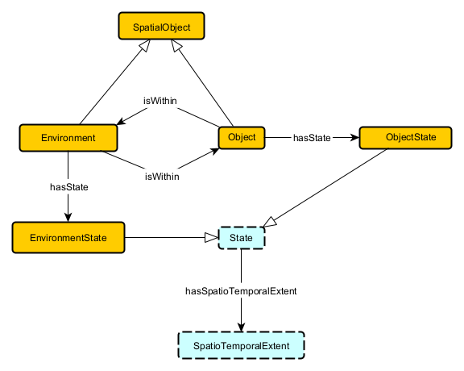

# Meeting Minutes

**Date: 10/28/2025**

## Agenda

1. Narrow constraints/finalize definitions, such as, for example, clarifying "State" verbiage. "State" was being used interchangeably for different key notions.
2. Finalize Key Notions/make any additional updates
3. Select potential ODPs/build ODPs for finalized Key notions.

## Notes

1. Finalized subclass notion for the State -- there will be an Environment State, Object State, Robot State., these are all subclasses of a higher State.

2. Debated how to define Environment (about an hour and a half of time)... with no final determination.

## Action Items

- For all people/general:

  - Review Environment notions, potentially write your own and iterate upon for Thursday

- Shreyas

  - Work on YED schemas for Categorization.

- Michael

  - YED for Capabilities, Archetype
  - Background (ocra, kg, etc.) on Paper

- Susan

  - Read MOMo paper
  - Write background about MOMo paper on our Paper

- Chris
  - Assist Susan with writing background on MOMo
  - Work on YED schemas for all defined Key Notions Task oriented usecase

## Contributors/Signatures

- Shreyas Casturi (2:05 pm)
- Michael McCain (2:14 pm)
- Susan Shrestha (3:41 pm)
- Chris Davis Jaldi (7:08 pm)
